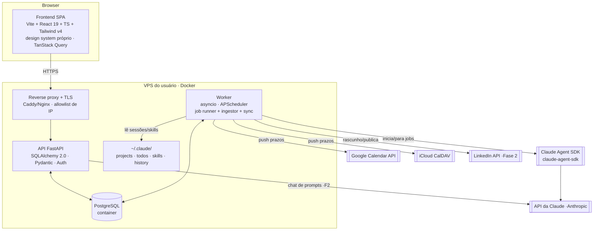

# ARCHITECTURE — Arquitetura

## Visão de componentes

## Camadas
- **Frontend (SPA):** Vite + React 19 + TypeScript. UI com **design system próprio** — CSS por classes dirigido por custom properties (paleta laranja, temas claro/escuro, fonte Open Sans), primitivos em `components/ui` (`kit`, `Modal`, `Drawer`, `Icon`). Tailwind v4 importado para utilitários pontuais. Kanban com drag HTML5 nativo. Estado de servidor com **TanStack Query**; UI/tema com **zustand**. Ver `docs/DESIGN_SYSTEM.md` e `docs/DESIGN_LAYOUT_COMPONENTS.md`.
- **API (FastAPI):** REST, validação Pydantic, autenticação, regras de negócio, ORM **SQLAlchemy 2.0**. Migrations com **Alembic**.
- **Worker:** processo separado (`asyncio`) responsável por: (1) **ingestor** que lê `~/.claude/` e grava no Postgres; (2) **job runner** que inicia/para agentes via Agent SDK; (3) **scheduler** (APScheduler) para crons (ex.: ingestão periódica, LinkedIn na Fase 2); (4) **sync** de calendário.
- **Postgres:** container Docker na VPS, volume persistente.
- **Reverse proxy:** TLS + allowlist de IP + rate limit no `/login`.

## Decisões-chave (resumo — detalhe nos ADRs)
1. **Integração com a Claude = SDK + leitura de disco** (ADR-001). Controle só do que o dashboard inicia; o resto é read-only.
2. **Ingestão para o Postgres** porque o Claude Code apaga sessões antigas (ADR-002).
3. **Fila de jobs no Postgres (`FOR UPDATE SKIP LOCKED`), sem Redis no MVP** (ADR-003). Redis/ARQ ficam como caminho de escala.
4. **Só o IP do SSH; segredos fora do app** (ADR-004).
5. **Sanitização de LinkedIn por origem, allowlist + denylist** (ADR-005).

## Fluxo de dados de "agentes/jobs"
- O **ingestor** roda em intervalo curto: lê `~/.claude/projects/*.jsonl`, `~/.claude/todos/*.json` e `history.jsonl`, faz upsert idempotente (`session_uuid` como chave) e marca status.
- Jobs **iniciados pelo dashboard** usam `ClaudeSDKClient`/`query()`; o runner transmite eventos (incl. Task tools: TaskCreate/Update/Get/List) para a tabela de jobs, permitindo cancelar.
- A UI lê do Postgres (não do disco diretamente), garantindo histórico mesmo após a limpeza do Claude Code.

## Deploy
- `docker compose` com serviços: `proxy`, `backend`, `worker`, `db`.
- O container `worker` monta `~/.claude` (read-only) e tem o `claude-agent-sdk` + CLI da Claude autenticada.
- Variáveis em `.env` (ver `PREREQUISITOS.md`). Backup de volume do Postgres recomendado.

## Stack default (puxado para `/feature` quando o usuário não especificar mais detalhe)
Python 3.11+, FastAPI, SQLAlchemy 2.0, Alembic, Pydantic v2, `claude-agent-sdk`, APScheduler · React 19, Vite, TypeScript, Tailwind v4 (design system próprio), TanStack Query, zustand, React Router · PostgreSQL 16, Docker Compose, Caddy.
