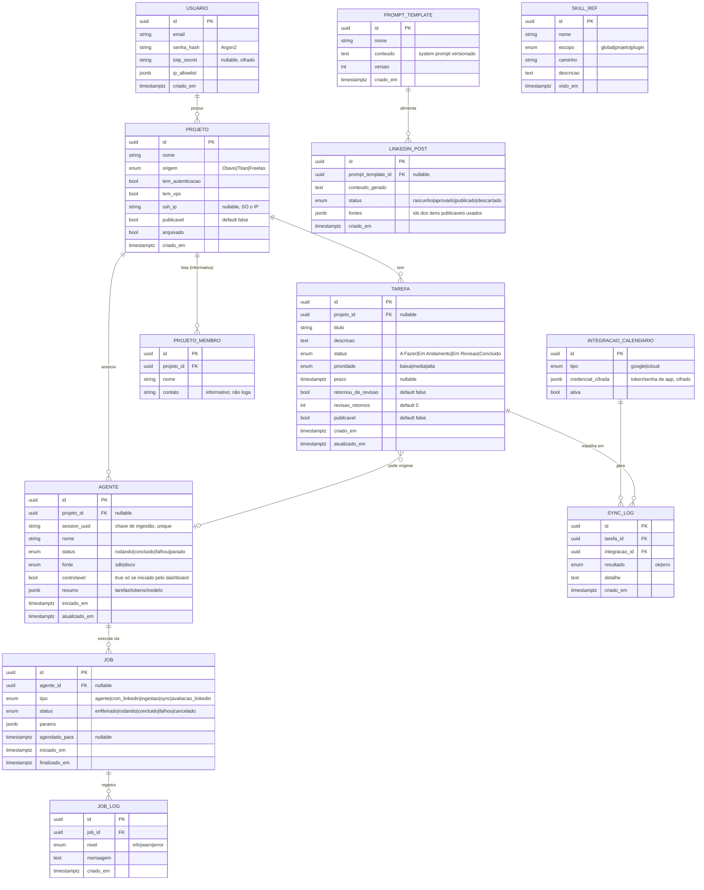

# DATA_MODEL — Modelo de dados

## Notas do dicionário
- **`PROJETO.ssh_ip`**: armazena exclusivamente o IP (string validada). Constraint: se `tem_vps = false`, `ssh_ip` deve ser `NULL` (RN-03). Nunca há coluna para chave/usuário/porta/senha.
- **`AGENTE.session_uuid`**: chave natural da ingestão; upsert idempotente (NFR-007). `controlavel = true` apenas quando `fonte = sdk` e o job foi iniciado pelo dashboard (RN-05).
- **`USUARIO.totp_secret` e `INTEGRACAO_CALENDARIO.credencial_cifrada`**: cifrados em repouso; a chave de cifragem vem de variável de ambiente / cofre, **fora** do banco (NFR-001).
- **`*.publicavel`**: porta da allowlist de LinkedIn (RN-04). Sem essa flag, o item nunca entra em conteúdo público.
- **`SKILL_REF`**: cache/inventário das skills lidas do disco; a fonte de verdade continua sendo o filesystem `~/.claude/skills`.
- Chaves: UUID v4. Timestamps `timestamptz`. Enums via tipo nativo do Postgres ou `CHECK`.
