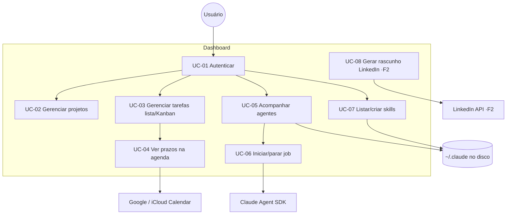

# USE_CASES — Casos de uso



## UC-01 — Autenticar (FR-001..004, NFR-002/003)
**Ator:** Usuário. **Pré:** IP permitido pela allowlist.
```gherkin
Cenário: Login bem-sucedido com 2FA
  Dado que meu IP está na allowlist
  Quando informo senha correta e código TOTP válido
  Então recebo uma sessão autenticada com cookie HttpOnly+Secure

Cenário: IP fora da allowlist
  Dado que meu IP não está na allowlist
  Quando acesso o dashboard
  Então o acesso é bloqueado antes da tela de login
```

## UC-02 — Gerenciar projetos (FR-010..015, RN-03)
```gherkin
Cenário: Cadastrar projeto com VPS
  Dado que crio um projeto com origem "Titan"
  Quando marco "tem VPS = sim" e informo o IP "203.0.113.10"
  Então o projeto é salvo guardando apenas o IP, sem nenhum outro dado de SSH

Cenário: Bloquear IP sem VPS
  Dado um projeto com "tem VPS = não"
  Quando tento salvar um ssh_ip
  Então o sistema rejeita por violar a regra RN-03
```

## UC-03 — Gerenciar tarefas em lista e Kanban (FR-020..025, RN-01/02)
```gherkin
Cenário: Mover card no Kanban reflete na lista
  Dada a tarefa "Deploy" em "A Fazer"
  Quando arrasto o card para "Em Andamento"
  Então a mesma tarefa aparece como "Em Andamento" também na visão de lista

Cenário: Tarefa retorna da revisão
  Dada a tarefa "API de login" em "Em Revisão"
  Quando arrasto o card de volta para "Em Andamento"
  Então a tarefa fica marcada como "retornou de revisão" com contador = 1
```

## UC-04 — Ver prazos na agenda (FR-030..033)
```gherkin
Cenário: Sincronizar prazo com Google Calendar
  Dada uma tarefa com prazo amanhã às 10h e integração Google ativa
  Quando salvo a tarefa
  Então um evento correspondente aparece no Google Calendar
  E o resultado da sincronização é registrado
```

## UC-05 — Acompanhar agentes (FR-040..045)
```gherkin
Cenário: Listar agentes lidos do disco
  Dado que há sessões em ~/.claude/projects
  Quando abro a tela de Agentes
  Então vejo cada agente com status e projeto, e as sessões ficam persistidas no banco

Cenário: Sessão não iniciada pelo dashboard
  Dada uma sessão lida do disco que o dashboard não iniciou
  Quando a seleciono
  Então as ações de controle (parar/modificar) aparecem desabilitadas (read-only)
```

## UC-06 — Iniciar e parar um job (FR-043/044, FR-050/051)
```gherkin
Cenário: Iniciar job via Agent SDK
  Quando inicio um agente com um prompt e ferramentas permitidas
  Então o dashboard cria um job, mostra status "rodando" e atualiza em ≤ 5s

Cenário: Cancelar job próprio
  Dado um job iniciado pelo dashboard em "rodando"
  Quando clico em cancelar
  Então o job é interrompido e marcado como "cancelado"
```

## UC-07 — Listar e criar skills (FR-060..062)
```gherkin
Cenário: Criar skill nova
  Quando crio uma skill com nome e descrição válidos
  Então o sistema gera a pasta e o SKILL.md no diretório global de skills
  E a skill passa a aparecer na listagem
```

## UC-08 — Gerar rascunho de LinkedIn (Fase 2, FR-070..074, RN-04)
```gherkin
Cenário: Sanitização por origem
  Dado um projeto de origem "Otávio" marcado como publicável
  Quando gero o rascunho do post
  Então o nome real da empresa é ocultado e referido como "Projeto X"
  E não há link de GitHub nem de site
  E nenhum dado da denylist (IP de SSH, auth, membros) aparece no texto
```
